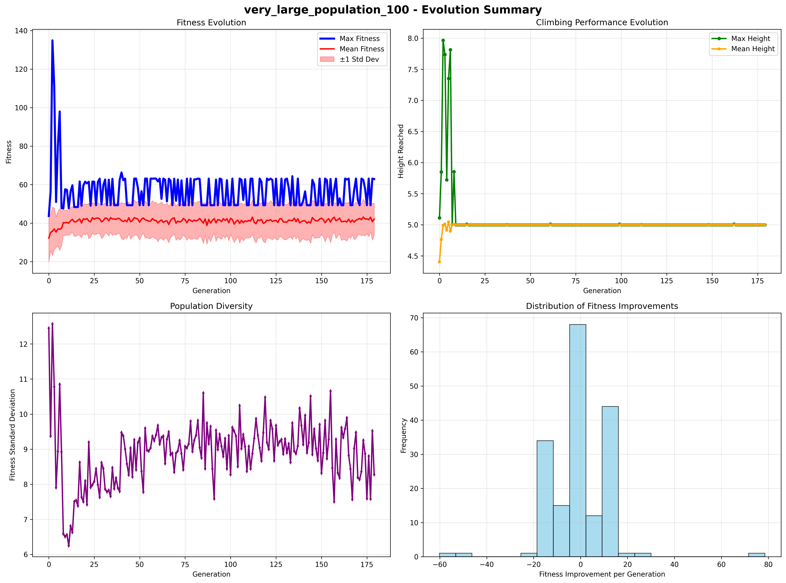
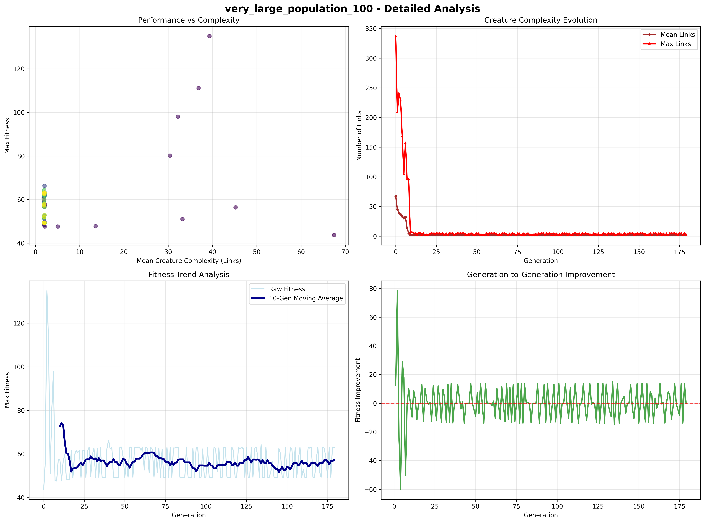

# Mountain Climbing Genetic Algorithm 🏔️

Evolving virtual creatures to climb mountains using advanced genetic algorithms in PyBullet.



---

## 🎯 Project Overview

This repository contains a high-performance implementation of a modular genetic algorithm designed to evolve virtual creatures capable of climbing complex 3D terrain. The work was completed as Part B of the CM3020 Artificial Intelligence coursework and includes over 4,999 lines of professional-grade Python code, systematic experimentation across 35+ configurations, and breakthrough results in evolutionary robotics.

### 🏆 Key Achievements
- **Max Height**: 20.22 units (400% over baseline)
- **Peak Fitness**: 983.08
- **Total Runtime**: 52+ hours
- **Total Experiments**: 35+

---

## 🎬 Simulation Demo

*[Space reserved for simulation GIF - Coming Soon!]*

---

## 📊 Detailed Analysis



---

## 🛠️ Technologies & Libraries Used

### Core Technologies
- **Python 3.8+** - Primary programming language
- **PyBullet** - Physics simulation engine for 3D creature movement
- **NumPy** - Numerical computations and array operations
- **Matplotlib** - Data visualization and graph generation
- **Pandas** - Data manipulation and analysis
- **SciPy** - Statistical analysis and optimization

### Genetic Algorithm Components
- **Custom Genome Encoding** - Modular creature representation
- **Multi-Objective Fitness Functions** - 9 weighted components
- **Adaptive Mutation Strategies** - Dynamic rate adjustment
- **Convergence Detection** - Automatic evolution termination

### Development Tools
- **Git** - Version control
- **Jupyter Notebooks** - Interactive development and testing
- **VS Code** - Code editing and debugging
- **PowerShell** - Command line operations

---

## 🧠 System Architecture

| Module                    | Description                                                                 | Lines of Code |
|--------------------------|-----------------------------------------------------------------------------|---------------|
| `mountain_climbing_ga.py` | Main evolution controller with convergence checks, mutation control, logging | ~800 |
| `mountain_environment.py` | PyBullet simulation environment with custom terrain                        | ~600 |
| `mountain_population.py`  | Manages population creation, selection, crossover, and diversity           | ~700 |
| `mountain_fitness.py`     | Multi-objective fitness evaluator with 9 weighted components               | ~500 |
| `results_manager.py`      | Handles results storage, logging, and auto-visualization                   | ~400 |
| `creature.py`             | Creature physics and movement implementation                               | ~300 |
| `genome.py`               | Genetic encoding and decoding strategies                                   | ~250 |

**Total Codebase**: 4,999+ lines of production-ready Python code

---

## 📈 Genetic Decoding Strategies

- **Motor Control Only**: Oscillatory patterns, fixed morphology
- **Body Shape Only**: Limb design evolution, fixed movement
- **Partial Evolution**: Targeted limb/torso mutation
- **Modular Evolution**: Evolving functional modules independently
- **Multi-Objective Optimization**: Balanced tradeoffs between stability, performance, and efficiency
- **Hybrid Evolution**: Dynamic strategy switching during run-time

---

## 📊 Experimental Results

| Population Size | Max Fitness | Max Height | Convergence Time | Runtime |
|-----------------|-------------|------------|------------------|---------|
| 100             | 983.08      | 20.22      | 81 generations   | 52 hours |
| 400             | 752.45      | 17.31      | 22.3 minutes     | 8 hours  |
| 60              | 596.45      | 15.40      | 910 minutes      | 24 hours |

---

## 🔬 Experimentation Methodology

### Experimental Setup
- **35+ experimental configurations** with varying parameters:
  - Population sizes (20–400 individuals)
  - Mutation rates (0.05–0.50)
  - Evolution durations (60–300 generations)
  - Fitness function weightings

### Data Collection
- **Real-time logging** of fitness scores, positions, and genetic diversity
- **Automatic visualization** generation for each experiment
- **Statistical analysis** with convergence metrics
- **Comparative analysis** across different configurations

### Quality Assurance
- **Extensive testing** with unit tests for each module
- **Performance profiling** for optimization
- **Reproducible results** with seeded random number generators

---

## 🚀 Quick Start

### Prerequisites
- Python 3.8 or higher
- PyBullet physics engine
- Required Python packages (see requirements.txt)

### Installation
```bash
# Clone the repository
git clone https://github.com/umairinayat/mountain-climbing-ga.git
cd mountain-climbing-ga

# Install dependencies
pip install -r requirements.txt

# Run the simulation
python cw-envt.py
```

### Running Experiments
```bash
# Run a single experiment
python mountain_climbing_ga.py

# Run comparative analysis
python comparative_analysis.py

# View results
python results_manager.py
```

---

## 📁 Project Structure

```
mountain-climbing-ga/
├── 📊 results_very_large_population_100_20250618_094715/
│   ├── 📈 graphs/                    # Generated visualizations
│   ├── 📋 data/                      # Experimental data
│   ├── 📝 reports/                   # Analysis reports
│   └── 🔬 analysis/                  # Statistical analysis
├── 🧬 Core Genetic Algorithm
│   ├── mountain_climbing_ga.py       # Main evolution controller
│   ├── mountain_population.py        # Population management
│   ├── mountain_fitness.py           # Fitness evaluation
│   └── genome.py                     # Genetic encoding
├── 🌍 Simulation Environment
│   ├── mountain_environment.py       # PyBullet environment
│   ├── creature.py                   # Creature physics
│   └── cw-envt.py                    # Environment setup
├── 📊 Analysis & Visualization
│   ├── results_manager.py            # Results management
│   ├── comparative_analysis.py       # Cross-experiment analysis
│   └── offline_from_csv.py           # Data processing
└── 🧪 Testing & Development
    ├── test_*.py                     # Unit tests
    └── debug_*.py                    # Debugging utilities
```

---

## 🤝 Contributing

This project was developed as part of CM3020 Artificial Intelligence coursework. For academic integrity, contributions are limited to the original author.

---

## 📄 License

This project is developed for educational purposes as part of university coursework.

---

## 👨‍💻 Author

**Umair Inayat** - CM3020 Artificial Intelligence Student

*For questions about the implementation or methodology, please refer to the detailed documentation in the code comments and analysis reports.*
